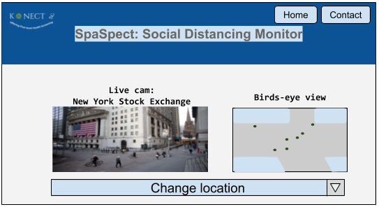

# SpaSpect

This is a social distancing checker. It works by constructing a 3D map to accurately determine the distance between people

# Dependencies
- cppunit

	- Follow steps at https://freedesktop.org/wiki/Software/cppunit/.

	- Then move <cpp_unit>/include/cppunit to /usr/local/include/cppunit.

	- Also move <cpp_unit>/src/cppunit to /usr/local/src/cppunit

- numcpp

	- Follow installation steps at https://dpilger26.github.io/NumCpp/doxygen/html/md__c_1__github__num_cpp_docs_markdown__installation.html
